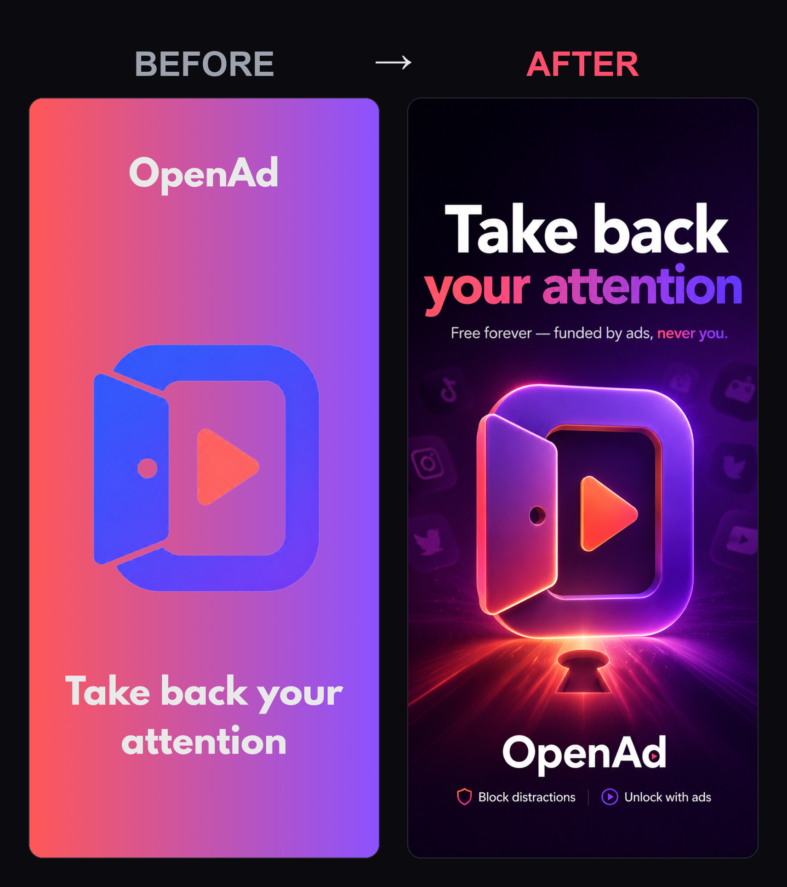
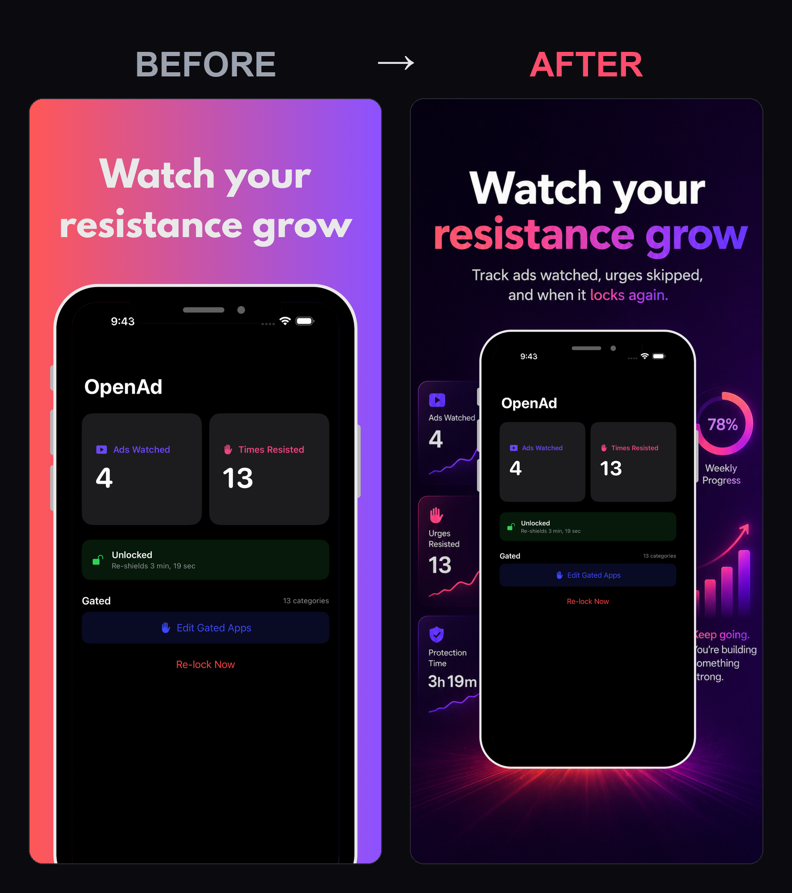

# App Store Screenshots — Generate a Polished, On-Brand Screenshot Set with ChatGPT

Turn your raw Xcode simulator screenshots and your logo into a converting App Store carousel — one HERO frame plus several feature frames, all sharing one locked style — by walking ChatGPT image generation through a plan, then a few guided pastes, and finishing with a quick crop in Canva.

> **Best results:** treat this like briefing a senior designer, not asking for "a nice picture." Define ONE style system up front (palette, type, device, lighting) and make every frame inherit it — that single rule is what separates a premium set from a Frankenstein patchwork that makes your app look buggy.

> **Why a SET, not one image:** ~90% of users never scroll past screenshot 3, and on iPhone the first three show right in search results. Lead with your hook, one benefit per frame, captions readable at thumbnail size. The first three frames do ~70% of the converting.

---

## See it in action

Two real frames from **OpenAd** (a free screen-time app), each built with this exact process — left is the rough first idea, right is the finished App Store frame.

**Hero frame**



**Feature frame** (note the real, crisp screenshot composited into the device on the right)



---

## What to attach (do this first)

Do everything in **one fresh ChatGPT conversation** (a model with image generation) and keep it in that one thread start to finish — that's how ChatGPT remembers your approved hero and matches the rest to it. Before you paste anything, get your inputs ready:

1. **Your raw app screenshots** — open your app in the Xcode simulator and press **Cmd+S** to save each screen as a clean PNG to your Desktop. Grab one screen per frame you want (your best/most distinctive screen for the hero, plus one per benefit). Use the actual shipping screens — the UI inside the device frame must be genuine, or Apple rejects it.
2. **Your logo** — a clean PNG, ideally on a transparent background. Only the HERO frame needs it.
3. **Short context about the app** — name, what it does, who it's for, brand colors (hex), and the one reason to pick you over competitors. You'll type this into the [BRACKETS] in Step 1.

You attach the relevant image(s) to each message right before you paste that step's prompt.

---

## The process

This is a worksheet (Step 0) plus four pastes: plan it, generate the hero, generate each feature frame, then reframe in Canva. Pick your screen-fidelity option once and keep it the same on every frame.

### Step 0 — Plan your captions first (Value → Usage → Trust)

Decide your frames before you generate anything. It's a sales pitch, not a tutorial: lead with the differentiator, one benefit per frame, most persuasive first. Captions are 2–6 words, a benefit (what the user *gets*) not a feature — weak: "Track your water"; strong: "Never feel dehydrated again." No "#1" or "best" (Apple prefers descriptive copy and it converts better). Fill this in for yourself:

```text
Frame 1 (HERO / the hook):     [DIFFERENTIATOR CAPTION]   <- your single biggest "why us"
Frame 2 (core benefit):        [BENEFIT CAPTION]
Frame 3 (proof / key benefit): [RATINGS, FREE-FOREVER, AWARD, OR KEY BENEFIT]
Frame 4 (depth - optional):    [SECONDARY BENEFIT]
Frame 5 (close - optional):    [FINAL BENEFIT OR SOFT CTA]
```

Aim for 3–5 frames total. Can't name your differentiator? Ask ChatGPT first: paste your app description and ask "what's the one differentiator I should lead with on screenshot #1?"

---

### Step 1 — Lock the style system and the plan (no images yet)

Attach your screenshots + logo, fill the [BRACKETS], and paste this. ChatGPT will reply with a proposed STYLE SYSTEM and frame plan **as text** — that's intended, not a failure. Read it, edit anything you don't like, and approve it before generating. This text block becomes the anchor every later frame inherits.

```text
You are my senior brand designer. We are building a consistent SET of App Store screenshots for my iOS app. Do NOT generate any images yet. First we plan.

ATTACHED:
- The app screenshots = my real, shipping app screens.
- The logo = my brand logo.

ABOUT THE APP:
- App name: [APP NAME]
- What it does, one line: [WHAT IT DOES]
- Who it's for: [WHO IT'S FOR]
- The single biggest reason to choose it over competitors (the hook): [YOUR DIFFERENTIATOR]
- Brand colors as hex: [BRAND COLOR HEX, e.g. near-black #0B0B0F base, #7C3AED purple -> #FF4D6D coral gradient]
- Vibe in three words: [VIBE, e.g. bold, modern, dark]

Your job in this step:
1. Propose a STYLE SYSTEM I will reuse on every frame so the whole set looks consistent. Define concretely, in plain text:
   - Background: color field or gradient, with exact hex values.
   - Device: one modern iPhone model, the angle (slight 10-degree three-quarter, floating), lighting (soft studio key from top-left), and a subtle reflection beneath. Same model and angle on every frame.
   - Typography: a clean geometric sans-serif; headline heavy and large; optional subtitle lighter, one line.
   - Layout: caption in the TOP THIRD as a big high-contrast headline; device in the lower ~60%; generous safe margins and negative space at the very top and bottom.
   - Palette: the hex list to use across all frames.
2. Propose a frame PLAN ordered as a sales pitch, not a tutorial:
   - Frame 1 = HERO: my logo + a big headline selling the differentiator.
   - Frames 2-N = one benefit per frame, most persuasive first.
   For each frame, suggest a headline of 2-6 words that sells the BENEFIT not the feature, plus an optional one-line subtitle under 12 words. No superlatives, no "#1" or "best".
3. Tell me which of my attached screenshots best fits each frame.

Reply with the STYLE SYSTEM and the PLAN in plain text so I can approve or edit. Do not generate images yet.
```

When the plan looks right, reply "approved" (or paste your edits) and move to Step 2.

---

### Step 2 — Generate the HERO frame

This is the most valuable real estate you own: the first frame shows in search results without a tap. Lead with the differentiator, not a splash or login screen.

First pick your **screen-fidelity option** — the one thing that makes or breaks an AI-made screenshot. ChatGPT tends to re-render pasted screenshots and blur small text, so:

- **Option A — place the real screenshot crisply.** One step, no Canva for the screen. But only safe when the screen is large, simple, and sparse. Check it at 100% zoom; if any text is fuzzy, switch to B.
- **Option B — flat placeholder screen, composite later (default).** ChatGPT renders a clean flat brand-color screen and you drop your real, crisp PNG onto it in Canva. One extra step, guaranteed-sharp text. **Use B for any data-dense screen** (lists, settings, dashboards). Both options keep genuine shipping UI inside the frame, which is what Apple requires.

The block below is pre-set to **Option B**. To use A instead, replace the line marked SCREEN with the Option-A line shown right under the block. Attach this frame's screenshot + your logo to the message, then paste:

```text
Now generate the HERO frame using the STYLE SYSTEM we approved above. Apply that style system exactly - do not drift.

ATTACHED to this message: Image 1 = my app screenshot for this frame. Image 2 = my brand logo. Place the logo as a lockup near the top; do NOT redraw or re-letter it.

LAYOUT: tall portrait App Store screenshot. Headline in the TOP THIRD as a large, high-contrast title. Device in the lower ~60%. Clear negative space and safe margins at the very top and bottom so nothing important sits near the edges.

HEADLINE - render exactly as written, ALL CAPS, in quotes, with padding so nothing is clipped: "[HERO CAPTION - 2-6 WORDS, THE DIFFERENTIATOR]"
OPTIONAL SUBTITLE - one line, under 12 words: "[OPTIONAL SUBTITLE]"

SCREEN: Render the device with a flat [BRAND COLOR HEX] placeholder screen - leave the screen rectangle clean and empty so I can composite my real screenshot onto it in Canva. Do not invent fake UI.

FORMAT: tall portrait, generate at 1024x1536, high quality. Ensure all text fits with padding, nothing clipped. I will crop this to exact App Store size later, so keep everything within safe margins.

Generate the image now.
```

To use Option A instead, swap the SCREEN line for:
```text
SCREEN: Inset Image 1 onto the device screen exactly as given - keep it pixel-sharp and legible. Do NOT re-render, re-letter, or restyle any of its UI text.
```

When the hero looks right, approve it in the thread. **Zoom out to 25% (thumbnail size)** — if you have to squint to read the headline, tell ChatGPT to make it bigger and shorter and regenerate before you move on. The hero is the anchor the whole set matches to.

---

### Step 3 — Generate each feature frame (paste once per frame, same thread)

Generate the rest one per message, in the same thread, restating the style and your screen-fidelity choice each time so the model doesn't drift. Attach **this frame's screenshot to this message** every time (don't rely on earlier attachments). The block is pre-set to Option B — if you chose A, swap the SCREEN line the same way as the hero.

```text
Generate the next FEATURE frame. Match the approved HERO and STYLE SYSTEM exactly: same background, same gradient and palette hex, same iPhone model + angle + lighting, same typography, same margins and layout. It must look like part of the same set. Do not drift.

ATTACHED to this message: Image 1 = the app screenshot for this frame. No logo on this frame - the logo lives only on the hero.

Show ONE benefit only.
HEADLINE - render exactly as written, ALL CAPS, in quotes, 2-6 words, benefit not feature, with padding so nothing is clipped: "[FEATURE CAPTION]"
OPTIONAL SUBTITLE - one line, under 12 words: "[OPTIONAL SUBTITLE]"

LAYOUT: tall portrait. Headline in the top third, device in the lower ~60%, clear negative space and safe margins top and bottom.

SCREEN: Render the device with a flat [BRAND COLOR HEX] placeholder screen - clean and empty for me to composite my real screenshot in Canva. Do not invent fake UI.

FORMAT: tall portrait, generate at 1024x1536, high quality. Nothing clipped; keep everything within safe margins for cropping.

Generate the image now.
```

Repeat for each feature frame. Keep the same A/B choice across all frames so the set stays consistent.

**If one frame drifts** (wrong color, different angle, clipped text), don't start over — stay in the thread and fix just that frame:

```text
Regenerate that last frame only. Keep the EXACT same style system as the others: same background gradient and palette hex, same iPhone model and 10-degree three-quarter angle, same top-left studio light and reflection, headline in the top third, device in the lower ~60%, identical margins, tall portrait 1024x1536, high quality. Keep the caption exactly: "[CAPTION]". Change only this: [WHAT TO FIX]. Generate the image now.
```

---

### Step 4 — Reframe to exact App Store size in Canva

ChatGPT can't output Apple's exact pixel dimensions, and Apple validates size pixel-for-pixel. You generated at a tall portrait (1024×1536, a ~2:3 shape), and the App Store frame is **taller** (~9:19.5). That mismatch is exactly why the safe-margins / negative-space instruction was load-bearing: with breathing room top and bottom, this final step is a mechanical crop/scale — not a redesign.

1. In Canva, make a custom design at **1290 x 2796 px** (the required 6.7" iPhone size — this one upload auto-scales down to every smaller iPhone, so it's the only set you must provide). For maximum sharpness on the newest Pro Max hardware, use **1320 x 2868 px** instead (the 6.9" size) — same shape, just larger.
2. Drop each generated frame in and scale/crop to fill, keeping the headline and device inside the frame (your safe margins make this easy).
3. **If you used Option B** (or any Option-A screen came out fuzzy): drop your real, crisp exported screenshot onto the device's blank screen, align it to the screen rectangle, and you're done — your real UI text stays sharp and genuine, which is what Apple requires.
4. Export each frame as **PNG or JPEG, RGB, no transparency**, at that exact size. Upload 3–10 in carousel order: HERO first, then your benefit frames.

---

## How to use it

1. **Fill in every [BRACKET] with your specifics:**
   - **[APP NAME]** — your app's name.
   - **[WHAT IT DOES]** / **[WHO IT'S FOR]** — one plain-English line each.
   - **[YOUR DIFFERENTIATOR]** — the one reason to pick you over a competitor; this is the hero's whole job. If you can't name it, ask ChatGPT to help you find it first.
   - **[BRAND COLOR HEX]** — your exact hex values (e.g. `#0B0B0F` near-black, `#7C3AED` purple → `#FF4D6D` coral). Always paste hex, in every step, so color stays consistent.
   - **[VIBE]** — three words for the mood (bold, modern, dark).
   - **[HERO CAPTION]** and each **[FEATURE CAPTION]** — 2–6 words, a benefit not a feature ("NEVER LOSE A TASK," not "TASK SYNC"). No "#1" or "best."
   - **[OPTIONAL SUBTITLE]** — one line under 12 words, or delete the line.
2. **Attach the right images to each message:** screenshots + logo for Step 1; the hero's screenshot + logo for Step 2; each feature frame's screenshot (no logo) for Step 3. Export screenshots from the Xcode simulator with **Cmd+S**.
3. **Plan captions in Step 0** (Value → Usage → Trust), then **run Step 1** and actually read the proposed style system and plan. Edit, approve — this is where you catch a bad caption or wrong differentiator for free, before spending generations.
4. **Pick Option A or B** for screen fidelity. Use **B** (the default) for any screen with lists, settings, or small text — the AI blurs dense text, so you composite the real screenshot in Canva. Use **A** only for a hero with large, minimal UI, and verify at 100% zoom.
5. **Run Step 2** to make the hero, check it at 25% thumbnail size, then **run Step 3** once per feature frame in the same thread — re-pasting the style every time and keeping the same A/B choice. Use the repair block if a frame drifts.
6. **Reframe in Canva** (Step 4) to exactly **1290 x 2796 px** (or 1320 x 2868 for max sharpness), composite your real screenshot if you used Option B, export PNG/JPEG RGB with no transparency, and upload HERO-first.
7. **Sanity check the whole set:** same background, same device + angle, same fonts on every frame; one benefit per frame; first three frames each land in under two seconds; real shipping UI inside every device.

---

Made by [@agenticmatt](https://www.instagram.com/agenticmatt) · more prompts coming.
